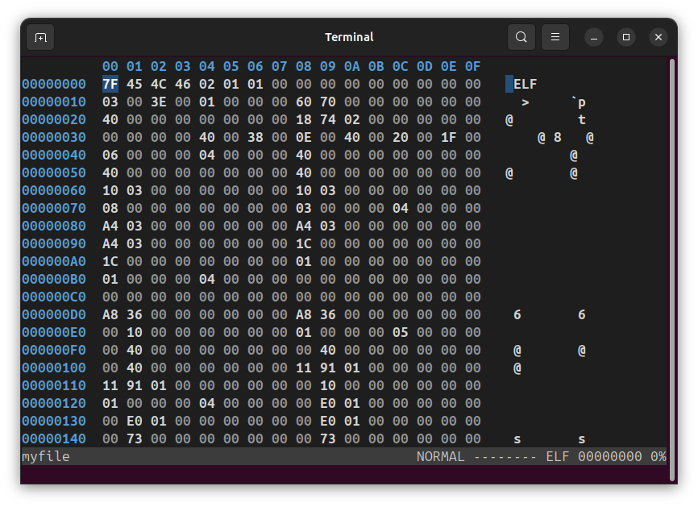

# dz6

A vim-inspired, TUI-based hexadecimal editor

## Features

- Fast, even when editing large files
- Runs in the terminal / Text User Interface (TUI)
- vim-like key bindings
- Configurable options
- Edit in hex or ASCII
- String list with regex filtering
- Multiple smart ways to navigate through a file
- Find strings and hex bytes
- Cross-platform
- Open source

## Screenshot



## Installation

### Rust package manager (all operating systems)

Follow the instructions [here](https://rust-lang.org/tools/install/) to install **cargo**. Then, open up
a terminal and type:

    cargo install dz6

### FreeBSD

    pkg install dz6

### Windows

If you have [WinGet](https://learn.microsoft.com/en-us/windows/package-manager/), install dz6 with:

    winget install mentebinaria.dz6

Alternatively, download the [release](https://github.com/mentebinaria/dz6/releases) package for your system.

## Usage

```
Usage: dz6 [OPTIONS] <FILE>

Arguments:
  <FILE>  File to open

Options:
  -o, --offset <OFFSET>  Initial cursor offset (hex default; `t` suffix = decimal) [default: 0]
  -r, --readonly         Set read-only mode
  -h, --help             Print help
  -V, --version          Print version
```

Once you load a file in **dz6**, you can use the commands below.

### Global key bindings

| Key     | Action           | Tips                      |
| ------- | ---------------- | ------------------------- |
| `Enter` | Switch views     | Currently Hex and Text    |
| `Alt+l` | Open log window  |                           |
| `:`     | Open command bar | See [Commands](#commands) |

#### Commands

| Command        | Action                                                           | Parameters             | Tips/Examples                                                                                     |
| -------------- | ---------------------------------------------------------------- | ---------------------- | ------------------------------------------------------------------------------------------------- |
| `<number>`     | Go to offset                                                     |                        | hex default; `t` suffix = decimal; `+` prefix = incremental jump                                  |
| `cmt`          | Comment                                                          | `<offset>` `<comment>` | `cmt 1000 "my comment"` (offset obeys the same rules above)                                       |
| `set byteline` | Set the number of bytes per line                                 | `<number>`             | `set byteline 8` (default is 16; range from 1 to 48)                                              |
| `set ctrlchar` | Set the character shown in the ASCII dump for non-graphic values | `<char>`               | `set ctrlchar " "` would set a blankspace (default: `.`)                                          |
| `set db`       | Turn on database file saving/loading (default)                   |                        | A database file with a `.dz6` extension will be used to store bookmarks and comments for the file |
| `set nodb`     | Turn off database file saving/loading                            |                        |                                                                                                   |
| `set dimzero`  | Dim (gray out) null bytes only (default)                         |                        |                                                                                                   |
| `set dimctrl`  | Dim all control characters                                       |                        | all non-graphic characters will be dimmed                                                         |
| `set nodim`    | Turn off byte dimming                                            |                        |                                                                                                   |
| `set theme`    | Set the theme                                                    | `dark` or `light`      | `set theme light` (default: `dark`)                                                               |
| `w`            | Write changes to file                                            |                        |                                                                                                   |
| `wq` or `x`    | Write changes to file and quit                                   |                        |                                                                                                   |
| `q`            | Quit without saving changes                                      |                        | In replace mode, `T` (truncate) is an exception because it modifies the file immediately.         |

If you need permanent settings, create a `$HOME/.dz6init` file containing any of the commands above, one per line. dz6 will load that at startup.

### Hex view

| Key                     | Action                                                                             | Tips                                                              |
| ----------------------- | ---------------------------------------------------------------------------------- | ----------------------------------------------------------------- |
| Arrow keys              | Navigation                                                                         | vim-like `h`, `j`, `k`, `l` also work                             |
| `w` `d` `q`             | Advance by a word (2 bytes), a dword (4 bytes), or a qword (8 bytes), respectively | Use the capital letters `W`, `D`, and `Q` to move backwards       |
| `o`                     | Go to the next other byte (the one that differs from the byte under the cursor)    | `O` goes backwards                                                |
| `Home` or `0`           | Set the cursor to the beginning of the current line                                |                                                                   |
| `End` or `$`            | Set the cursor to the end of the current line                                      |                                                                   |
| `Ctrl+Home` or `G`      | Go to the first offset                                                             |                                                                   |
| `Ctrl+End` or `Shift+G` | Go to the last offset in the file                                                  |                                                                   |
| `Page Down`             | Move down one page                                                                 |                                                                   |
| `Page Up`               | Move up one page                                                                   |                                                                   |
| `r`                     | Enter [replace mode](#hex-replace-mode)                                            |                                                                   |
| `z`                     | Enter replace mode and set the byte under the cursor zero                          |                                                                   |
| `Ctrl+a`                | Enter replace mode and increment byte under the cursor                             |                                                                   |
| `Ctrl+x`                | Enter replace mode and decrement byte under the cursor                             |                                                                   |
| `v`                     | Enter [select mode](#hex-selection-mode)                                           |                                                                   |
| `u`                     | Undo a change                                                                      |                                                                   |
| `/`                     | Search                                                                             | Search the entire file. `Tab` cycles between ASCII and hex search |
| `n`                     | Search next                                                                        |                                                                   |
| `s`                     | Open [Strings](#strings) window                                                    |                                                                   |
| `Backspace`             | Go to the previously visited offset                                                | This is useful after a Go to command, for example                 |
| `+`                     | Add current offset to bookmarks                                                    |                                                                   |
| `-`                     | Go to the last added bookmark                                                      |                                                                   |
| `Alt+1..8`              | Go to bookmark                                                                     |                                                                   |
| `Alt+-`                 | Remove the last added bookmark                                                     | The cursor must be at the bookmarked offset                       |
| `Alt+0`                 | Clear bookmarks                                                                    |                                                                   |
| `Alt+h`                 | Toggle byte highlight                                                              |                                                                   |
| `;`                     | Add a comment to the selected offset                                               |                                                                   |
| `Ant+n`                 | Open [Names](#names) window. Added comments will be there.                         |                                                                   |
| `?`                     | Open [Calculator](#calculator)                                                     |                                                                   |

#### Hex selection mode

| Key        | Action                           | Tips                                                                             |
| ---------- | -------------------------------- | -------------------------------------------------------------------------------- |
| Arrow keys | Navigation (left and right only) | vim-like `h`, `l` also work                                                      |
| `n`        | Fill selected bytes with NOPs    | This puts dz6 in replace mode; press `Enter` to save the buffer; `Esc` to cancel |
| `z`        | Fill selected bytes with zeroes  | Same as above                                                                    |
| `y`        | Copy bytes to system's clipboard | There is no paste command yet                                                    |
| `Esc`      | Go back to normal mode           |                                                                                  |

#### Hex replace mode

| Key         | Action                                                     | Tips                                                     |
| ----------- | ---------------------------------------------------------- | -------------------------------------------------------- |
| Arrow keys  | Navigation                                                 |                                                          |
| `Backspace` | The same as navigating left                                |                                                          |
| `z`         | Set byte to zero                                           |                                                          |
| `Ctrl+a`    | Increment byte                                             |                                                          |
| `Ctrl+x`    | Decrement byte                                             |                                                          |
| `Esc`       | Go back to normal mode                                     | Changes are saved to buffer, but not written to file yet |
| `Tab`       | Cycle through hex and ASCII dump to edit the file in ASCII |                                                          |
| `T`         | Truncate the file at the selected offset                   | Be aware this can't be undone                            |

#### Names

| Key         | Action                                           | Tips         |
| ----------- | ------------------------------------------------ | ------------ |
| Arrow keys  | Navigation                                       | Up/Down only |
| `f`         | Filter names using a regular expression          |              |
| `D`         | Delete all names                                 |              |
| `Esc`       | Close                                            |              |
| `End`       | Select the last item shown                       |              |
| `Ctrl+End`  | Select the last item on the list                 |              |
| `Home`      | Select the first item shown                      |              |
| `Ctrl+Home` | Select the first item on the list                |              |
| `Page Down` | Go down one page                                 |              |
| `Page Up`   | Go up one page                                   |              |
| `Enter`     | Follow the name in hex dump and close the window |              |

#### Strings

| Key         | Action                                             | Tips                           |
| ----------- | -------------------------------------------------- | ------------------------------ |
| Arrow keys  | Navigation                                         | Up/Down only                   |
| `f`         | Filter strings using a regular expression          |                                |
| `R`         | Re-read strings from file                          | Useful if you changed the file |
| `Esc`       | Close                                              |                                |
| `End`       | Select the last item shown                         |                                |
| `Ctrl+End`  | Select the last item on the list                   |                                |
| `Home`      | Select the first item shown                        |                                |
| `Ctrl+Home` | Select the first item on the list                  |                                |
| `Page Down` | Go down one page                                   |                                |
| `Page Up`   | Go up one page                                     |                                |
| `Enter`     | Follow the string in hex dump and close the window |                                |

#### Calculator

64-bit calculator. Default base is decimal, but you can prefix hex numbers with 0x. Pre-defined variables:

| Variable | Value                       | Length                                                    |
| -------- | --------------------------- | --------------------------------------------------------- |
| `@x`     | Signed value under cursor   | `x` is `b` (byte), `w` (word), `d` (dword) or `q` (qword) |
| `@X`     | Unsigned value under cursor | `X` is `B` (byte), `W` (word), `D` (dword) or `Q` (qword) |
| `@o`     | Current offset              | dword on 32-bit systems; qword on 64                      |
| `@O`     | Previously visited offset   | same as above                                             |

Use the up and down arrow keys to navigate through the history.

### Text view

> This view hasn’t received much attention yet. This view still has several issues.

| Key | Action                         |
| --- | ------------------------------ |
| `e` | Open encoding selection dialog |

## FAQ

**1. I'm on a Mac. How am I supposed to use `Alt` key?!**

iTerm2 users: go to `Settings → Profiles → (your profile) → Keys` and set the `Left Option key` to `Esc+`. This will make the `Option` key work like `Alt`.

**2. Do all vim commands work in dz6?**

No. Some key bindings behave similarly, but dz6 is not meant to be 100% compatible with vim. For example, `o` in dz6 moves to the next other byte, while the same key in vim opens a new line below the current one.

**3. Is dz6 stable yet?**

No. Stability is expected only at v1.0.0. Until then, breaking changes are expected.

## Motivation

After changing jobs and returning to Linux, I wanted something similar to [Hiew](https://hiew.io) that I could run on my machine. Since I like vim, I tried to combine features from both editors in dz6. VSCode, IDA, x64dbg, GDB, and [Hex-Patch](https://etto48.github.io/HexPatch/) also served as inspiration. Hats off to the authors of these great tools!
